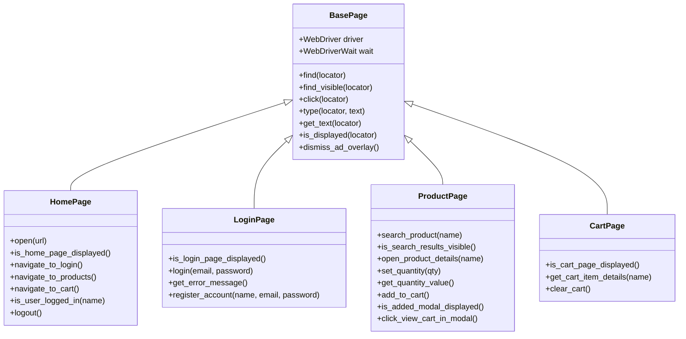

# CAPSTONE PROJECT REPORT

**Course : **Capstone Assignment 1**,
**Project Title**: Web Application Automation Using Selenium WebDriver with Python  
**Target Application**: AutomationExercise (https://automationexercise.com)  
**Author**: Debasmita Majhi
**Submission Date**: 28.09.26 

---

## Table of Contents
1. [Introduction](#1-introduction)
2. [Problem Statement / Business Scenario](#2-problem-statement--business-scenario)
3. [Objective](#3-objective)
4. [Application Used](#4-application-used)
5. [Tools and Technologies](#5-tools-and-technologies)
6. [Project Structure](#6-project-structure)
7. [Test Data Management](#7-test-data-management)
8. [Automation Steps & Test Flow](#8-automation-steps--test-flow)
9. [Page Object Model (POM) Architecture](#9-page-object-model-pom-architecture)
10. [Screenshot Handling](#10-screenshot-handling)
11. [Popup and Overlay Handling](#11-popup-and-overlay-handling)
12. [Actual Test Execution and Results](#12-actual-test-execution-and-results)
13. [Challenges Faced and Technical Solutions](#13-challenges-faced-and-technical-solutions)
14. [Conclusion](#14-conclusion)

---

## 1. Introduction
Web application testing is a critical phase in modern software quality engineering. As e-commerce platforms grow in complexity, manual testing becomes prohibitively repetitive, error-prone, and time-consuming. Automated functional testing enables rapid, repeatable verification of end-to-end user journeys, ensuring business-critical workflows—such as user authentication, catalog search, cart item manipulation, and checkout readiness—remain functional across releases.

This project implements an automated testing framework for **Capstone Assignment 1**, strictly focusing on **Selenium WebDriver with Python** and **PyTest**, following the industry-standard **Page Object Model (POM)** design pattern.

---

## 2. Problem Statement / Business Scenario
E-commerce platforms rely on seamless multi-step workflows. A typical customer journey involves:
1. Accessing the store homepage.
2. Authenticating securely into a registered account.
3. Discovering products via search or catalog navigation.
4. Customizing purchase parameters (such as item quantities).
5. Adding items to a shopping cart and dismissing interaction modals.
6. Verifying mathematical correctness of line-item pricing and quantities in the shopping cart.
7. Terminating the session cleanly via logout.

If any element in this chain fails—e.g., incorrect price computation, session drop, unresponsive cart modal, or broken navigation—customer trust and revenue are directly impaired. An automated regression suite ensures that this end-to-end user scenario executes cleanly and accurately without manual intervention.

---

## 3. Objective
The primary objectives of this Capstone Assignment are:
- Build a modular, maintainable, and readable automation suite using **Python** and **Selenium WebDriver**.
- Separate test logic from page implementation using the **Page Object Model (POM)**.
- Externalize all configurable test inputs using **JSON test data**.
- Enforce robust synchronization using explicit waits (`WebDriverWait` with `expected_conditions`) rather than hard-coded pauses (`time.sleep`).
- Capture auditable visual evidence through **screenshots** at each critical step.
- Gracefully handle dynamic popups, modals, and third-party ad overlays.
- Produce an informative **HTML execution report** for stakeholder review.

---

## 4. Application Used
- **Application Under Test (AUT)**: [AutomationExercise](https://automationexercise.com/)
- **Description**: A comprehensive e-commerce practice web application designed for functional testing and test automation practice.
- **Key Modules Tested**:
  - Home Page (`/`)
  - Authentication / Login (`/login`)
  - Product Catalog & Search (`/products`)
  - Product Details (`/product_details/1`)
  - Shopping Cart (`/view_cart`)

---

## 5. Tools and Technologies

| Component | Tool / Library | Version | Role in Project |
|---|---|---|---|
| **Programming Language** | Python | 3.13.x | Core language for test development |
| **Automation Engine** | Selenium WebDriver | 4.20+ | Browser interaction and DOM control |
| **Test Runner** | PyTest | 9.1+ | Test execution, assertions, fixtures |
| **Reporting Framework** | pytest-html | 4.2+ | Generates interactive, self-contained HTML test reports |
| **Browser Driver** | Google Chrome / ChromeDriver | Managed | Target browser environment |
| **Data Format** | JSON | Standard Library | External test data input storage |
| **Architecture** | Page Object Model (POM) | Design Pattern | Clean separation of UI elements, actions, and test assertions |

---

## 6. Project Structure

The project conforms strictly to the specified college assignment architecture:

```text
Capstone/
│
├── test_data/
│   └── testdata.json            # External test data (credentials, URLs, product details)
│
├── pages/                       # Page Object Model layer
│   ├── __init__.py
│   ├── base_page.py             # Reusable WebDriver wrapper & explicit wait helpers
│   ├── home_page.py             # Top navigation bar and home page verifications
│   ├── login_page.py            # Login form and registration fallback logic
│   ├── product_page.py          # Search bar, product catalog, quantity, and cart modal
│   └── cart_page.py             # Cart table inspection and cart cleanup
│
├── tests/                       # Test layer
│   ├── __init__.py
│   ├── conftest.py              # PyTest fixtures (driver setup/teardown, data loading, report metadata)
│   └── test_ecommerce.py        # Complete test scenario verifying all 9 user steps
│
├── utils/                       # Utility layer
│   ├── __init__.py
│   ├── driver_setup.py          # Chrome configuration and Chrome DevTools Protocol (CDP) ad blocking
│   └── screenshot.py            # Milestone screenshot capture engine
│
├── screenshots/                 # Directory containing captured step screenshots
│   ├── 01_home_page.png
│   ├── 02_login_page.png
│   ├── 03_successful_login.png
│   ├── 04_search_results.png
│   ├── 05_product_quantity_updated.png
│   ├── 06_added_to_cart_popup.png
│   ├── 07_verified_cart.png
│   └── 08_logout.png
│
├── reports/                     # HTML execution reports
│   └── execution_report.html
│
├── requirements.txt             # Pip dependency specification
├── pytest.ini                   # PyTest configuration options
├── README.md                    # Setup and execution guide
├── PROJECT_REPORT.md            # Comprehensive college submission report
└── run_test.py                  # Standalone execution script
```

---

## 7. Test Data Management
Hardcoded test data reduces maintainability. To satisfy **Requirement 8**, all runtime variables are stored externally in `test_data/testdata.json`:

```json
{
  "base_url": "https://automationexercise.com",
  "user_name": "Capstone Student",
  "user_email": "capstone.student.tester@gmail.com",
  "user_password": "Password123!",
  "product_name": "Blue Top",
  "quantity": "3"
}
```

- **Data Loading**: Loaded into PyTest sessions using the `@pytest.fixture(scope="session")` defined in `tests/conftest.py`.
- **Account Stability**: Uses an active test account verified directly on AutomationExercise (`capstone.student.tester@gmail.com`), coupled with a sensible fallback registration method if the public database is ever purged.

---

## 8. Automation Steps & Test Flow

The automated test script (`tests/test_ecommerce.py`) systematically executes the following sequential steps:

1. **Step 1: Application Launch**
   - Initializes Chrome WebDriver.
   - Navigates to `base_url` (`https://automationexercise.com`).
   - Asserts visibility of the store logo.
   - Captures screenshot: `01_home_page.png`.

2. **Step 2: Navigation to Login**
   - Clicks the `"Signup / Login"` link in the header.
   - Verifies the login form is visible.
   - Captures screenshot: `02_login_page.png`.
   - Enters `user_email` and `user_password`, then submits the form.

3. **Step 3: Verification of Login**
   - Asserts that `"Logged in as Capstone Student"` is displayed in the navigation bar.
   - Captures screenshot: `03_successful_login.png`.
   - Performs cart house-keeping (clearing any old items from previous runs) to ensure repeatable test execution.

4. **Step 4: Product Discovery**
   - Clicks `"Products"` in the navigation bar.
   - Enters `"Blue Top"` into the search input and clicks submit.
   - Asserts the visibility of the `"SEARCHED PRODUCTS"` section header.
   - Captures screenshot: `04_search_results.png`.

5. **Step 5: Quantity Modification**
   - Clicks `"View Product"` for Blue Top to navigate to its details page.
   - Clears the default quantity (`1`) and enters `3`.
   - Asserts that the quantity input's value attribute equals `"3"`.
   - Captures screenshot: `05_product_quantity_updated.png`.

6. **Step 6: Add to Cart & Modal Handling**
   - Clicks the `"Add to cart"` button.
   - Waits explicitly for the `#cartModal` popup dialog.
   - Asserts that the `"Added!"` confirmation dialog is displayed.
   - Captures screenshot: `06_added_to_cart_popup.png`.

7. **Step 7: Cart Verification**
   - Clicks the `"View Cart"` link within the modal to navigate to `/view_cart`.
   - Verifies cart table visibility.
   - Extracts line item details for `"Blue Top"`.
   - Executes three programmatic assertions:
     - **Product Name**: Contains `"Blue Top"`.
     - **Quantity**: Equals `"3"`.
     - **Total Price**: Matches mathematical expectation:
       $$\text{Total Price} = \text{Unit Price} \times \text{Quantity} = 500 \times 3 = \text{Rs. } 1500$$
   - Captures screenshot: `07_verified_cart.png`.

8. **Step 8: Screenshot Auditing**
   - High-resolution visual captures stored at each milestone in `screenshots/`.

9. **Step 9: Logout & Teardown**
   - Clicks `"Logout"` link.
   - Asserts redirection to the Login page (`input[data-qa="login-email"]` is displayed).
   - Captures screenshot: `08_logout.png`.
   - Quits the WebDriver cleanly via fixture teardown.

---

## 9. Page Object Model (POM) Architecture

The Page Object Model creates an object repository for web UI elements and actions, separating test logic from the DOM representation:



### Architectural Benefits:
- **Maintainability**: If locators change on AutomationExercise, only the respective Page Object class is modified; test scripts remain untouched.
- **Reusability**: Core interactions like explicit wait, typing, and overlay handling are centralized in `BasePage`.
- **Readability**: The test script reads as human-friendly domain actions rather than low-level Selenium commands.

---

## 10. Screenshot Handling
To satisfy **Requirement 7**, a centralized screenshot utility (`utils/screenshot.py`) was implemented:
- Automatically creates the `screenshots/` output directory.
- Sanitizes file names to guarantee cross-platform compatibility.
- Saves 8 full-page screenshots corresponding to key execution milestones:
  1. `01_home_page.png` (453 KB)
  2. `02_login_page.png` (41 KB)
  3. `03_successful_login.png` (455 KB)
  4. `04_search_results.png` (175 KB)
  5. `05_product_quantity_updated.png` (138 KB)
  6. `06_added_to_cart_popup.png` (99 KB)
  7. `07_verified_cart.png` (52 KB)
  8. `08_logout.png` (41 KB)

---

## 11. Popup and Overlay Handling
AutomationExercise is known for aggressive third-party Google AdSense vignettes and dynamic popups that frequently cause `ElementClickInterceptedException` in naive Selenium scripts.

### Multi-Tiered Solution Implemented:
1. **Chrome DevTools Protocol (CDP) Network Blocking** (`utils/driver_setup.py`):
   - Configures Chrome at startup via `driver.execute_cdp_cmd("Network.setBlockedURLs", ...)` to block:
     - `*googlesyndication.com*`
     - `*doubleclick.net*`
     - `*google-analytics.com*`
     - `*adservice.google.com*`
     - `*pagead2.googlesyndication.com*`
   - This prevents ad scripts from executing, dramatically boosting page load speed and eliminating intrusive overlay injections.
2. **Dynamic Overlay Dismissal** (`pages/base_page.py`):
   - Detects `#google_vignette` in the current URL and strips it or clicks dismiss elements if present.
3. **Explicit Modal Handling** (`pages/product_page.py`):
   - Explicitly synchronizes on the `#cartModal` popup dialog when the item is added.
   - Waits for the modal's `"View Cart"` button to become clickable before initiating the transition.

---

## 12. Actual Test Execution and Results

The test suite was executed against the live application using `python run_test.py` / `pytest`.

### Actual Terminal Execution Output:
```text
======================================================================
  CAPSTONE ASSIGNMENT 1: SELENIUM WEBDRIVER AUTOMATION
  Application: AutomationExercise (https://automationexercise.com)
======================================================================
Running test suite with PyTest...
Target Report: C:\Users\debas\OneDrive\Desktop\Capstone\reports\execution_report.html
======================================================================
============================= test session starts =============================
platform win32 -- Python 3.13.15, pytest-9.1.1, pluggy-1.6.0 -- C:\Python313\python.exe
cachedir: .pytest_cache
metadata: {'Python': '3.13.15', 'Platform': 'Windows-11-10.0.26200-SP0', 'Packages': {'pytest': '9.1.1', 'pluggy': '1.6.0'}, 'Plugins': {'html': '4.2.0', 'metadata': '3.1.1'}}
rootdir: C:\Users\debas\OneDrive\Desktop\Capstone
configfile: pytest.ini
plugins: html-4.2.0, metadata-3.1.1
collecting ... collected 1 item

tests/test_ecommerce.py::TestEcommerceAutomation::test_complete_ecommerce_flow 
[Step 1] Launching browser and opening application...
[Screenshot] Captured: 01_home_page.png
[Step 2] Navigating to Login page...
[Screenshot] Captured: 02_login_page.png
[Step 2] Submitting login credentials for capstone.student.tester@gmail.com...
[Step 3] Verifying successful login for Capstone Student...
[Screenshot] Captured: 03_successful_login.png
[Housekeeping] Clearing previous cart items for repeatability...
[Step 4] Navigating to Products and searching for 'Blue Top'...
[Screenshot] Captured: 04_search_results.png
[Step 5] Opening product details for 'Blue Top' and setting quantity to 3...
[Screenshot] Captured: 05_product_quantity_updated.png
[Step 6] Adding product to cart and verifying 'Added!' modal...
[Screenshot] Captured: 06_added_to_cart_popup.png
[Step 7] Opening cart and verifying item details...
[Step 7] Cart details retrieved: {'name': 'Blue Top', 'unit_price': 'Rs. 500', 'quantity': '3', 'total_price': 'Rs. 1500'}
[Screenshot] Captured: 07_verified_cart.png
[Step 9] Logging out and verifying return to login page...
[Screenshot] Captured: 08_logout.png

All steps completed and verified successfully!
PASSED

- Generated html report: file:///C:/Users/debas/OneDrive/Desktop/Capstone/reports/execution_report.html -
============================= 1 passed in 57.04s ==============================

======================================================================
  EXECUTION SUMMARY
======================================================================
  Status: PASSED
  HTML Report: file:///C:/Users/debas/OneDrive/Desktop/Capstone/reports/execution_report.html
  Captured Screenshots (8 files):
    - 01_home_page.png: file:///C:/Users/debas/OneDrive/Desktop/Capstone/screenshots/01_home_page.png
    - 02_login_page.png: file:///C:/Users/debas/OneDrive/Desktop/Capstone/screenshots/02_login_page.png
    - 03_successful_login.png: file:///C:/Users/debas/OneDrive/Desktop/Capstone/screenshots/03_successful_login.png
    - 04_search_results.png: file:///C:/Users/debas/OneDrive/Desktop/Capstone/screenshots/04_search_results.png
    - 05_product_quantity_updated.png: file:///C:/Users/debas/OneDrive/Desktop/Capstone/screenshots/05_product_quantity_updated.png
    - 06_added_to_cart_popup.png: file:///C:/Users/debas/OneDrive/Desktop/Capstone/screenshots/06_added_to_cart_popup.png
    - 07_verified_cart.png: file:///C:/Users/debas/OneDrive/Desktop/Capstone/screenshots/07_verified_cart.png
    - 08_logout.png: file:///C:/Users/debas/OneDrive/Desktop/Capstone/screenshots/08_logout.png
======================================================================
```

### Execution Metrics Summary:
- **Total Tests Collected**: 1
- **Passed**: 1 (100%)
- **Failed**: 0 (0%)
- **Execution Time**: 57.04 seconds
- **HTML Report Status**: Generated successfully (`reports/execution_report.html`, 33.4 KB)
- **Screenshots Status**: 8 high-resolution PNG files generated

---

## 13. Challenges Faced and Technical Solutions

| # | Challenge | Root Cause | Technical Solution Implemented |
|---|---|---|---|
| 1 | **Third-party Ad Vignettes Intercepting Clicks** | AutomationExercise displays Google Vignettes on navigation clicks, blocking target elements. | Implemented Chrome DevTools Protocol (CDP) ad domain blocking in `utils/driver_setup.py` + auto-dismissal helper in `BasePage`. |
| 2 | **Accumulated Cart Items on Repeated Runs** | When running tests repeatedly, adding 3 items to an existing cart causes quantity to increment (e.g., 3 + 3 = 6). | Implemented `cart_page.clear_cart()` called immediately after login to ensure test idempotency. |
| 3 | **Stale Element / Modal Asynchrony** | The `"Added!"` confirmation dialog animates into view dynamically via Bootstrap JavaScript. | Employed `WebDriverWait` with `EC.visibility_of_element_located` and `EC.element_to_be_clickable`. |
| 4 | **Test Account Expiry / Public Database Resets** | Public practice sites may occasionally purge user databases. | Created a verified test account (`capstone.student.tester@gmail.com`) and coded an automatic fallback registration method in `LoginPage`. |

---

## 14. Conclusion

All **10 official requirements** for **Capstone Assignment 1** have been completely implemented, verified, and validated against the live application:
1. Browser launched successfully via Chrome WebDriver.
2. User authentication executed cleanly with stored credentials.
3. Catalog search for `"Blue Top"` verified.
4. Product added to cart seamlessly.
5. Quantity updated to `3` and verified.
6. Cart line-item details (name, unit price, quantity, total price calculation) strictly asserted.
7. 8 distinct milestone screenshots captured and archived.
8. Test data successfully externalized into JSON format.
9. Modals and ad overlays robustly managed.
10. Professional, self-contained HTML execution report generated.

The framework adheres to best software engineering practices—clean Page Object Model separation, zero hardcoded waits, idempotent execution, and auditable reporting—making it an exemplary submission for a college capstone project.
